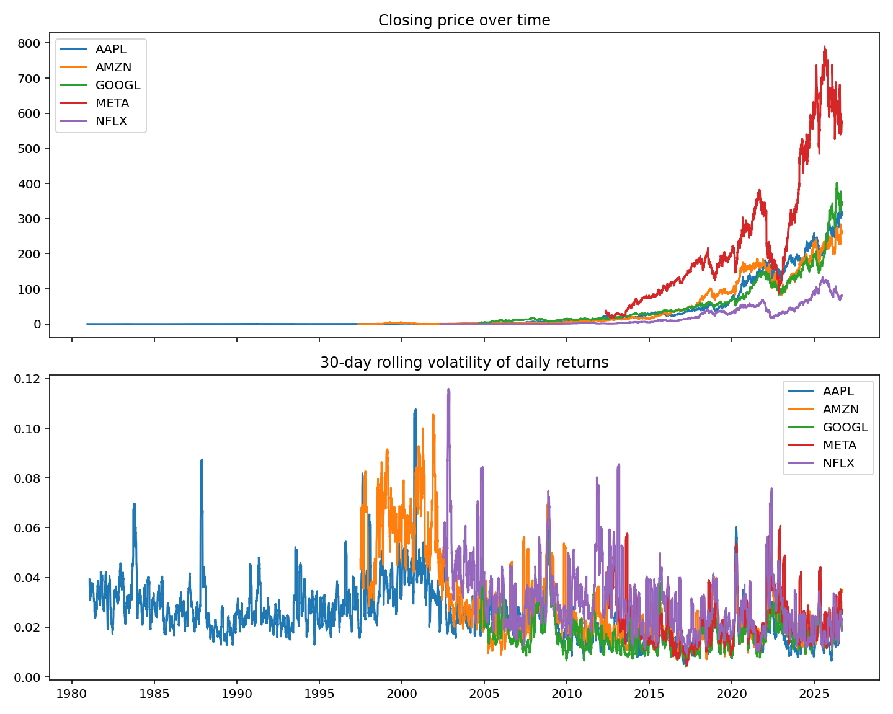

# S\&P 500 Volatility Analysis with LLM-Assisted Q\&A

A Python data pipeline that analyses historical S\&P 500 stock price data computing daily returns and rolling volatility across multiple tickers with a natural-language question-answering layer powered by Google's Gemini API.

## Overview

This project explores volatility patterns across a handful of major stocks (FAANG tickers), built as a self-directed mini-project to practice end-to-end data pipeline design, statistical time-series analysis, and practical LLM integration.

## What it does

* **Data loading and cleaning**: reads a large historical S\&P 500 price dataset, normalises column names, and parses dates
* **Ticker filtering**: narrows the dataset to a chosen set of stocks (currently META, AMZN, AAPL, NFLX, GOOGL)
* **Returns and volatility calculation**: computes daily percentage returns and 30-day rolling volatility (standard deviation of returns) per ticker
* **Visualisation**: plots closing price and rolling volatility over time for all selected tickers
* **LLM-assisted Q\&A**: summarises the computed statistics and sends them to Google's Gemini API to answer plain-English questions about the data (e.g. "which stock had the highest volatility, and what might explain that?")

## Example output



## Tech stack

* **Python**: pandas for data wrangling, matplotlib for visualisation
* **Google Gemini API** (`google-genai`): natural-language querying over the computed data
* **python-dotenv**: for secure API key management

## Setup

1. Clone the repo and install dependencies:

```bash
   pip install pandas matplotlib google-genai python-dotenv
   ```

2. Create a `.env` file in the project root with your Gemini API key:

```
   GEMINI\_API\_KEY=your-key-here
   ```

3. Place your dataset CSV in a `data/` folder and update `DATA\_PATH` in `main.py` if needed.
4. Run the script:

```bash
   python main.py
   ```

## Notes

* Uses Google AI Studio's free-tier Gemini API, kept deliberately free/low-cost as a personal project.
* Dataset not included in the repo - see setup instructions above for adding your own.

## About

Built by Fin Harris as a self-directed project, following on from a summer research placement in R-based data analysis at IDDO, Big Data Institute, University of Oxford.

